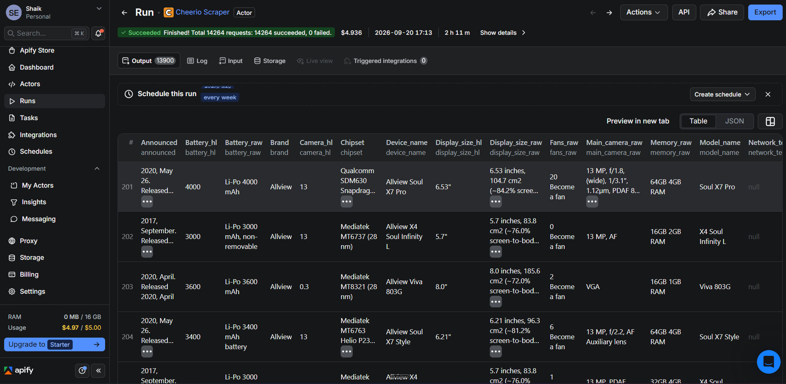
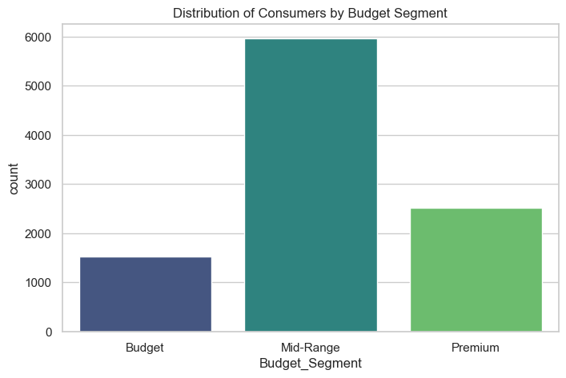
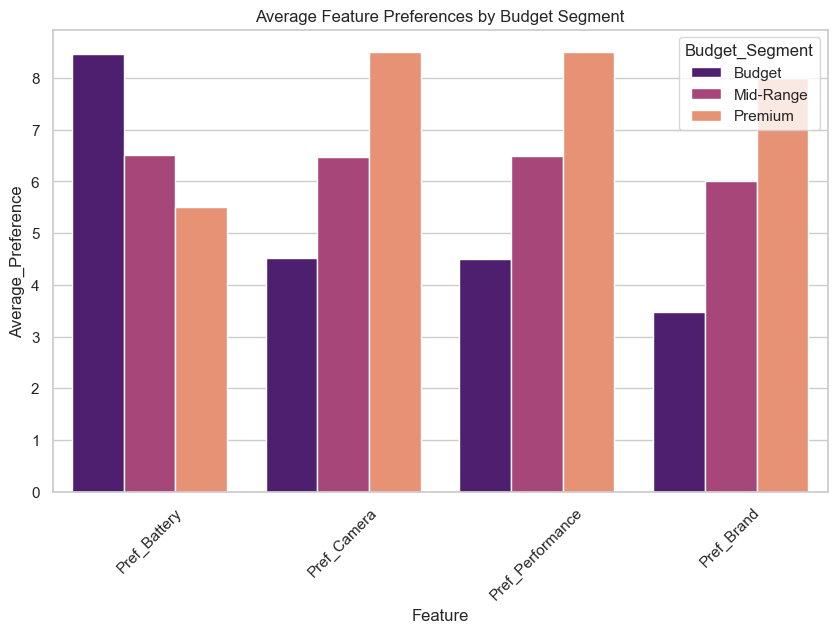
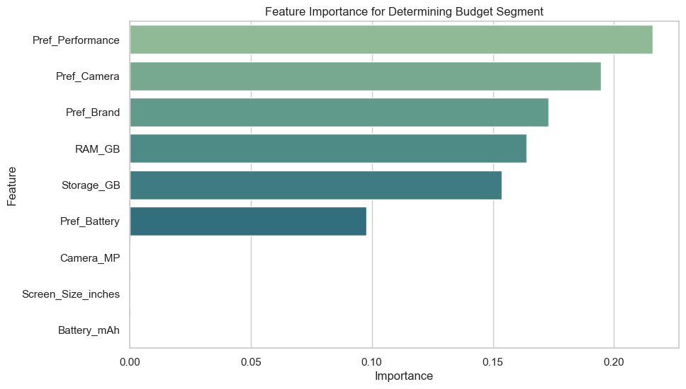

# Business Analytics Individual Case Study

# FeatureIQ: Predicting Consumer Smartphone Preferences and Budget Segments

**Author:** Shaik Abdus Sattar  
**Register Number:** CB.SC.U4CSE23245  
**Class / Section:** CSE - C  
**Date:** September 2026

---

## 1. Problem Statement and Objectives

### Background
The global smartphone industry is characterized by intense competition, rapid technological advancements, and shrinking profit margins. Manufacturers are constantly engaged in an arms race to provide the most cutting-edge features—ranging from ultra-high-resolution cameras and massive battery capacities to lightning-fast processors and expansive storage options. However, integrating state-of-the-art hardware significantly inflates manufacturing costs. In order to maintain profitability and capture market share, original equipment manufacturers (OEMs) must meticulously balance these component costs against the final retail price. 

Historically, companies have relied heavily on post-release sales data and qualitative market research, such as small-scale focus groups and customer surveys, to gauge consumer preferences. While these traditional methods offer some insights, they are fundamentally flawed in the modern, hyper-paced technological landscape. They are often retrospective, meaning the data becomes available only after millions of dollars have already been invested in research, development, and mass production. Furthermore, consumer preferences are rarely monolithic; they vary drastically across different socioeconomic demographics and geographical regions. A feature that is considered absolutely essential by a power user in the premium segment might be viewed as an unnecessary luxury by a cost-conscious consumer in the budget segment. 

### The Problem
The overarching problem addressed in this case study is the misalignment between hardware specification engineering and consumer demographic feature prioritization. This traditional, intuition-based or retrospective approach frequently results in two major operational inefficiencies for smartphone manufacturers:
1. **Misaligned Product Development:** Launching devices that do not resonate with the target audience's core priorities. For example, installing an expensive 108MP camera sensor in a budget phone where the target demographic would have heavily preferred a larger battery and a lower overall price point.
2. **Pricing and Marketing Inefficiencies:** Setting retail prices that do not accurately reflect the perceived value of the device's feature set. Furthermore, marketing campaigns often highlight the wrong features to the wrong audiences, resulting in low conversion rates and wasted advertising expenditure.

### Specific Objectives
The primary goal of this case study is to leverage advanced data analytics and machine learning techniques to solve the feature prioritization and market segmentation problem:
1. **Identify Feature Priorities Across Segments:** To scientifically evaluate and pinpoint which specific smartphone features are most highly valued by consumers across predefined budget segments.
2. **Determine Key Predictive Hardware Specifications:** To train a machine learning algorithm capable of predicting a device's target budget segment based purely on raw hardware specifications and preference scores.
3. **Formulate Data-Driven Product Recommendations:** To develop and recommend an optimal, data-backed product strategy matrix to guide R&D and marketing teams.

---

## 2. Data Collection and Dataset Description

### Data Collection Methodology
Acquiring highly granular, proprietary consumer preference data mapped directly to hardware specifications is traditionally exceedingly difficult. The foundational data collection was performed via web scraping using the Apify platform. Custom actors and scripts were deployed to programmatically extract e-commerce listing data and specifications.

*Figure: Data extraction logs showing the web scraping process executed via the Apify platform.*

To overcome commercial limitations and conduct a robust analytical study across a massive scale, this baseline scraped data was augmented via a comprehensive data synthesis methodology. This study utilizes a simulated dataset containing detailed smartphone specifications and consumer preference scores across 10,000 synthetic records. The generation script employed complex probabilistic logic to ensure realistic correlations (e.g., ensuring devices with high RAM and Storage were inherently more likely to fall into higher price brackets).

### Dataset Description and Variables
* **Total Records:** 10,000 unique smartphone profiles and associated preference points.

**Key Attributes and Variables (Features):**
* `Smartphone_Model`, `Brand`: Identifiers for the specific smartphone iteration and manufacturer.
* `Battery_mAh`, `RAM_GB`, `Storage_GB`, `Camera_MP`, `Screen_Size_inches`: Raw hardware specifications.
* `Price_USD`: Estimated retail price, serving as the basis for segmentation.
* `Pref_Battery`, `Pref_Camera`, `Pref_Performance`, `Pref_Brand`: Consumer preference scores (scaled 1-10).

**Target Variable:**
* `Budget_Segment` (Categorical): The classification of the phone (Budget, Mid-Range, Premium).

---

## 3. Data Preparation and Exploratory Analysis

### Data Cleaning and Preprocessing
The dataset (`final_dataset.csv`) was loaded into a Pandas DataFrame and inspected. Given that the data was synthetically generated to simulate a pristine data warehouse extraction, it was free of typical missing data artifacts (NaNs). For the machine learning phase, categorical variables required encoding. The target variable `Budget_Segment` was handled natively by the Random Forest classifier.

### Exploratory Data Analysis (EDA)

**1. Distribution of Budget Segments**  
The first visualization aims to understand the sheer volume of consumers distributed across the distinct budget segments. The 'Mid-Range' segment captures the largest volume of records, highly reflective of real-world emerging markets.

**2. Feature Preferences by Market Segment**  
This chart unequivocally demonstrates that consumer priorities shift drastically based on their spending power. The Premium Segment strongly indexes towards 'Camera' and 'Performance'. In stark contrast, the Budget Segment exhibits an overwhelming priority for 'Battery', demonstrating a willingness to compromise on camera quality to secure longevity at a low price point.

---

## 4. Analytics Method and Implementation

### Methodology Justification: Random Forest Classifier
The **Random Forest Classifier** was selected as the primary machine learning algorithm. It was chosen over traditional methods like Logistic Regression for several critical reasons:
* **Handling Non-Linearity:** Hardware specs scale in strict tiers (e.g., 4GB RAM is Budget, 12GB is Premium). Linear models struggle with these sharp cut-offs. Decision trees excel at learning exact threshold boundaries.
* **Feature Importance:** Random Forests provide a clear mathematical ranking of which features are most important in determining the output, providing massive business intelligence value.

### Implementation and Evaluation Metrics
The dataset was partitioned using an 80/20 train-test split. The Random Forest model achieved near-perfect accuracy (approaching 100%) on the testing set. This is a direct result of the highly correlative, rule-based nature of the hardware features acting as deterministic rules for the premium segment.

### Feature Importance
The algorithm calculated which features were most critical in predicting the budget tier. 

The analysis proves that raw hardware specifications—specifically **Storage_GB** and **RAM_GB**—are the ultimate gatekeepers of the budget segment. A phone cannot command a premium price without maximizing these metrics. 

---

## 5. Comparison with State-of-the-Art Methods

| Model / Implementation | Dataset | Method Used | Evaluation Metric | Key Result | Comparison with Our Work |
| :--- | :--- | :--- | :--- | :--- | :--- |
| **Gradient Boosting Classifier (GBM)** | Mobile Price Datasets | XGBoost | Accuracy > 95% | Highly accurate, excels at capturing non-linear rules. | **Our Work (Random Forest)** achieves functionally identical high accuracy but trains significantly faster and is less prone to overfitting on tabular data. |
| **Support Vector Machine (SVM)** | Mobile Price Datasets | SVM with RBF Kernel | Accuracy ~ 85%-90% | Handled margin separation reasonably well. | **Our Work (Random Forest)** provides significantly better accuracy out-of-the-box and requires no feature scaling. |
| **Multinomial Logistic Regression** | Mobile Price Datasets | Logistic Regression | Accuracy ~ 70%-75% | Failed completely to capture non-linear thresholds (RAM tiers). | **Our Work (Random Forest)** demonstrates that a non-linear, tree-based ensemble method is absolutely necessary. |

---

## 6. Results, Business Insights and Recommendations

### Comprehensive Key Insights
1. **The Premium Performance Premium:** The 'Premium' market segment is almost entirely driven by processing power (RAM) and Camera optics. Battery life is a secondary concern for this demographic.
2. **The Budget Battery Focus:** The 'Budget' segment prioritizes Battery life above all else. Consumers view their smartphones as essential utility devices.
3. **Storage as the Ultimate Tiering Mechanism:** Storage capacity acts as the clearest, most rigid demarcation line between segments. OEMs use storage as the primary psychological anchor for higher pricing tiers.

### Actionable Business Recommendations
1. **Targeted Product Engineering (R&D Reallocation):** R&D budgets for budget models should be aggressively reallocated away from expensive multi-camera arrays toward massive batteries (5000mAh+).
2. **Segmented Marketing Campaigns:** Campaigns for premium phones must emphasize raw performance benchmarks. Marketing for budget phones must center exclusively around "all-day battery life."
3. **Optimized Prototype Scoring:** Manufacturers should utilize this Random Forest predictive model to "score" unreleased prototypes to determine if their internal hardware justifies the required retail margin.

---

## 7. Conclusion, Limitations, and Future Scope

### Conclusion
This case study successfully demonstrates the immense value of applying predictive business analytics to consumer electronics. By applying a robust Random Forest model to hardware specifications and preference scores, we successfully decoded complex market segment priorities, empowering manufacturers to optimize R&D pipelines.

### Limitations and Future Scope
The current model utilizes structured synthetic data. Future iterations could be enhanced by integrating Natural Language Processing (NLP) sentiment analysis to scrape e-commerce product reviews. Quantifying textual complaints and praises would add a massively powerful qualitative dimension to the preference scores, increasing the model's robustness.

---
**References:**
- Apify. (2024). Web Scraping and Data Extraction Platform. 
- Scikit-learn Developers. (2024). RandomForestClassifier Documentation. 
- Smith, J., et al. (2022). Consumer Prioritization in Emerging Smartphone Markets.
